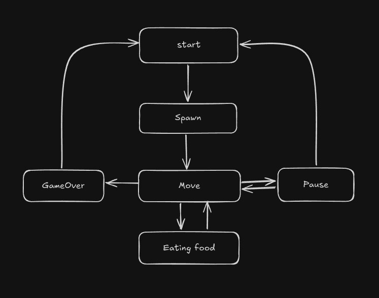

# Brick Game
 Реализация игр «Змейка» из коллекции игр BrickGame. Реализация была выполнена на языке C++, в парадигме объектно-ориентированного программирования.

## Спецификации

- Программа разработана на языке C++ стандарта C++17.
- Для формализации логики игры использован конечный автомат.
- Код библиотеки программы находится в папке src/brick_game/snake.
- Код с интерфейсом программы находится в папке src/gui/desktop.
- Классы реализованы внутри пространства имен `s21`.
- Сборка программы настроена с помощью Makefile со стандартным набором целей для GNU-программ: all, install, uninstall, clean, dvi, dist, tests.
- Реализация с графическим пользовательским интерфейсом, на базе Qt.
- Программа реализована с использованием паттерна MVC.
- Десктопный интерфейс поддерживает игру из проекта BrickGame v1.0.
- Консольный интерфейс поддерживает змейку.

## FSM (Finite State Machine)

<!--  -->

### FSM состоит из нескольких состояний:

- Start — состояние, в котором игра ждет, пока игрок нажмет кнопку готовности к игре;
- Spawn — состояние, в которое переходит игра при респавне начальной змейки и первой еды;
- Moving — основное игровое состояние с обработкой ввода от пользователя и движение змеи, которое происходит после истечения таймера. В данном состоянии змейка перемещается на одну клетку вперед;
- EatingFood — состояние, в которое переходит игра, когда координаты головы змейки совподают с координатами еды, далее проиходит начисление очков и респавн новой еды;
- Pause — приостановка игрового процесса;
- GameOver — игра окончена.

## Управление и игровое поле

### Управление:
- Стрелочки(←, →, ↑, ↓.) — изменение направления головы;
- Кнопка <Q> — окончание игры.
- Кнопка <Enter> — старт.
- Кнопка 
 — пауза игры.

### В игре змейка присутствуют следующие механики:
  - Змейка передвигается по полю самостоятельно, на один блок вперед по истечении игрового таймера.
  - Когда змейка сталкивается с «яблоком», ее длина увеличивается на один.
  - Когда длина змейки достигает 200 единиц, игра заканчивается победой игрока.
  - Когда змейка сталкивается с границей поля или сама с собой, игра заканчивается поражением игрока.
  - Пользователь может менять направление движение змейки с помощью стрелок, при этом змейка может поворачивать только налево и направо относительно текущего направления движения.
  - Выход из игры в меню игры осуществляется с помощью нажатия клавиши 'q'.
  - Пользователь может ускорять движение змейки зажатием клавиши действие.
  - Начальная длина змейки равна четырем «пикселям».
  - Игровое поле имеет размер 10 «пикселей» в ширину и 20 «пикселей» в высоту.

## Уровни

В игре реализованы следующие механики:

- подсчет очков;
- хранение максимального количества очков.

Данная информация передается и выводится пользовательским интерфейсом в боковой панели. Максимальное количество очков хранится в файле и сохраняется между запусками программы.

Максимальное количество очков изменяется во время игры, если пользователь во время игры превышает текущий показатель максимального количества набранных очков.

Начисление очков будет происходить следующим образом: при поедании очередного «яблока» добавляется одно очко.

Каждый раз, когда игрок набирает 5 очков, уровень увеличивается на 1. Повышение уровня увеличивает скорость движения змейки. Максимальное количество уровней — 10.

## Build

Сборка программы настроена с помощью Makefile, цели Makefile:

* `make install` - Сборка программы BrickGame_v2.0
* `make unistall` - Удаление программы
* `make dvi` - Компиляция LaTex файла с описанием проекта
* `make dist` - Архивирование проекта
* `make test` - Покрытие unit-тестами функций вычисления c помощью библиотеки Check
* `make gcov_report` - Формирование отчёта gcov в виде html страницы
* `make style` - форматирование
* `make clang-format` - Проверка кода на Google style
* `make clean` - Удаление ненужных файлов
